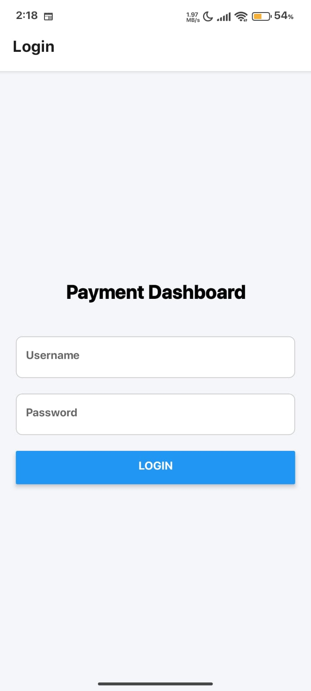
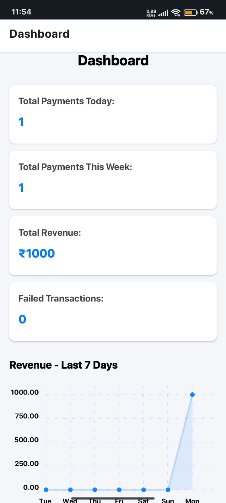

# 💳 Full Stack Payment Dashboard App

A mobile-first payment dashboard built with React Native (Expo) and NestJS (backend).  
It lets you log in securely, track payments, add new transactions, and see revenue trends.

---

## 🚀 Features

- 🔐 Login with JWT (stored securely using expo-secure-store)
- 📊 Dashboard with key stats (today’s payments, weekly revenue, failed counts)
- 🧾 Transaction list with filters (status, method, date)
- 📈 Revenue chart (last 7 days)

---

## 🧠 Tech Stack

| Layer     | Tech                    |
|-----------|-------------------------|
| Frontend  | React Native (Expo)     |
| Backend   | NestJS                  |
| Auth      | JWT                     |
| Database  | MongoDB (MongoDB Atlas) |
| Charts    | react-native-chart-kit  |

---

## 🔐 Sample Login

```

Username: admin
Password: admin123

```

These are hardcoded in the backend (can be replaced with a real DB later).

---

## 📁 Folder Structure

```

/client     # React Native frontend
/server     # NestJS backend

````

---

## 🛠️ How to Run It Locally

### 1. Frontend (React Native via Expo)

```bash
cd client
npm install
npx expo start --no-web
```

* Use **Expo Go** on your phone and scan the QR code.

* wait for 10-20 seconds for render to wake up server
---

## 🖼️ Screenshots

<h3>🔐 Login Screen</h3>


<h3>📊 Dashboard</h3>


---

## ✅ To-Do / Future Work

* Add user roles (admin/viewer)
* Export to CSV
* WebSocket support for real-time updates
* Auth via DB instead of hardcoding

---

## 📬 Author

Built with ❤️ by [@bilaljaved01](https://github.com/bilaljaved01)
